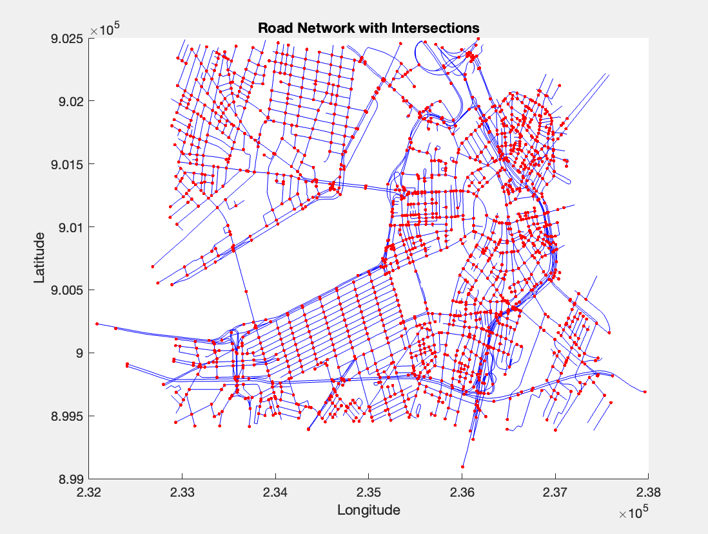
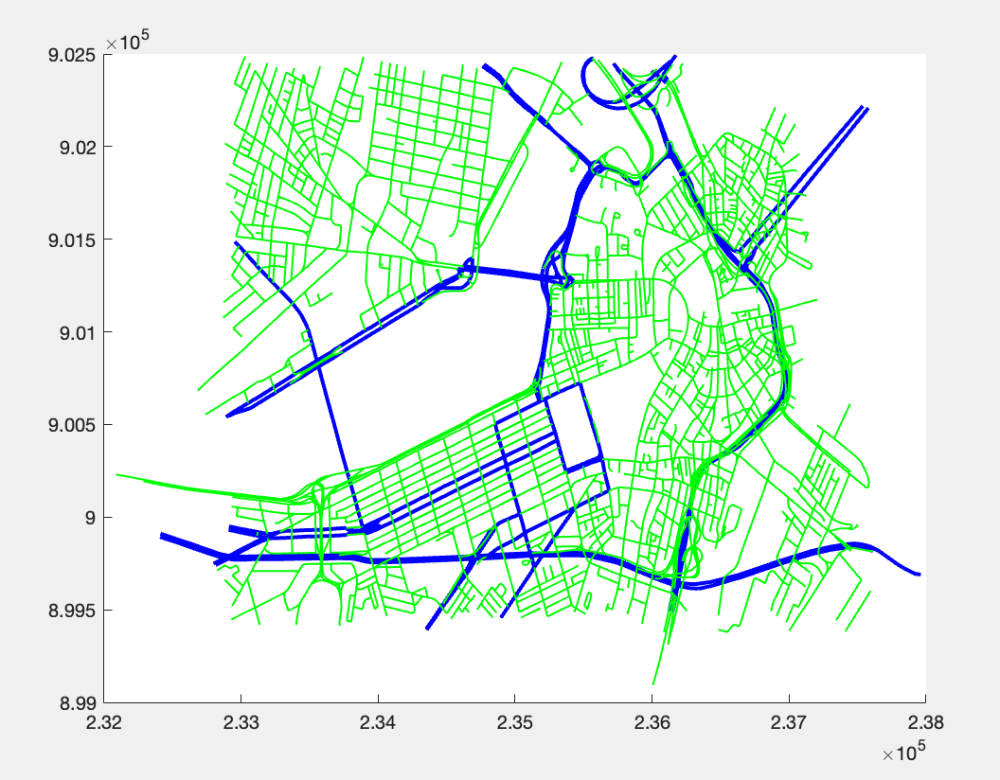

# Routen Plannung App– Methodische Grundlagen 🚀🌍

## Was ich gelernt habe 🎓

- Verarbeitung und Visualisierung von **Shapefiles** mit MATLAB 🗺️  
- Erstellung und Analyse von **Graphen** zur Modellierung von Wegenetzen 🔗  
- Implementierung von **Routing-Algorithmen** (Dijkstra, A*) in MATLAB 🛣️  
- Anwendung von **Map Matching** zur Korrektur von GPS-Daten 📍  
- Nutzung der **Laplace-Matrix** für Netzwerkanalysen 📊  
- Heuristische **Tourenplanung** (Ameisenalgorithmus) in MATLAB 🐜  
- Konstruktion von **minimal spannenden Bäumen** 🌲

## Wie ich es umgesetzt habe 🛠️

- MATLAB-Skripte zur Darstellung und Bearbeitung von Geodaten 💻  
- Programmierung von Graphen und Pfadalgorithmen direkt in MATLAB ⚙️  
- Entwicklung eigener Funktionen für Map Matching und Tourenplanung 🔧  
- Mathematische Analysen mittels Laplace-Matrix und Singulärwertzerlegung 📐

## Fazit ✔️

Das Praktikum hat mir gezeigt, wie ich MATLAB effektiv zur Lösung geoinformatischer Aufgaben einsetzen kann und mein Verständnis für Algorithmen und Geodatenstrukturen deutlich vertieft.

---
